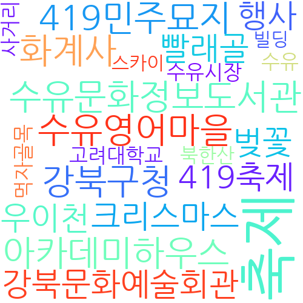
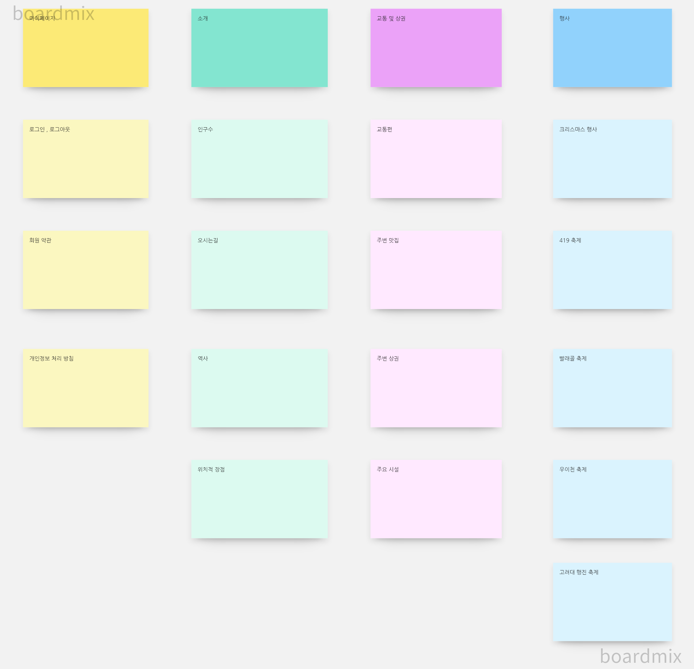
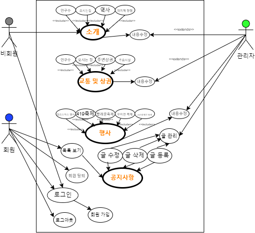
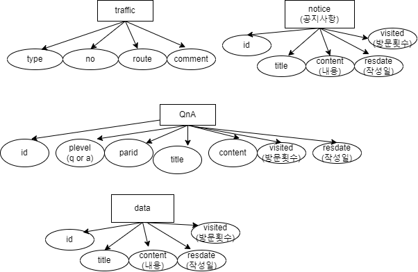
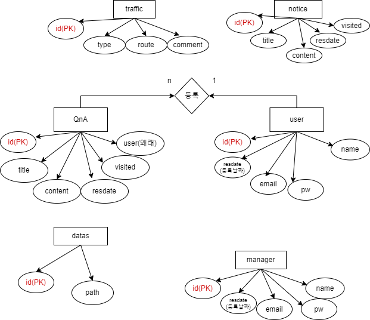
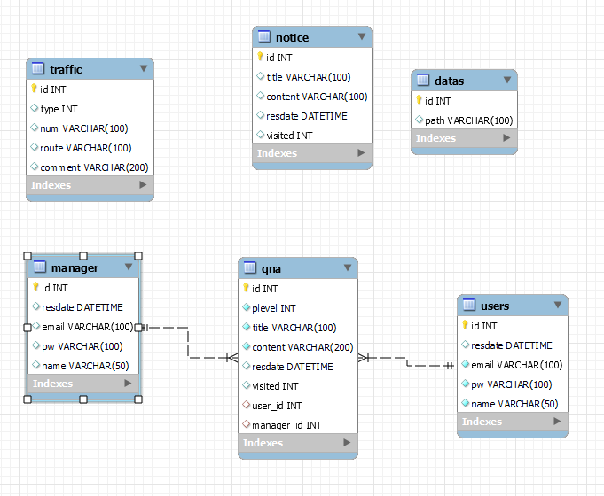

# 프로젝트 개발 보고서(Project Development Report)
------------------------------------------------
## 1. 프로젝트 개요(Project Outline)
       
        강북구에서 가장 핫한 수유동을 소개하기 위한
        자바 웹 애플리케이션을 개발하게 되었다.

## 2. 프로젝트 목적(Project Purpose)

        수유동의 역사와 지역적 특성, 각종행사들과 주변 상권들에 대해서 알려주고
        교통편과 질의 응답까지 할 수 있는 프로젝트 개발 

## 3. 프로젝트 개발 환경 정보(Project Development Envirment)

        - Topic : suyu intro web application
        - Develop Envirment : Open JDK 11
        - Language : Java 11
        - Web Module : Jsp/Servlet 3.0
        - Process Pattern : MVC Pattern
        - Database System : Mysql 8.0
        - Database Design : Mysql Workbench
        - Entity Relationship Design : draw.io 20.8.16
        - Java Database Connector : mysql-connector-java-8.0
        - Application Design : Object aid 1.2.4
        - Back Template Language : Java/Servlet 11
        - Front Template Language : Jsp(JSTL/EL) 3.0/HTML5/CSS3/Javascript ES5
        - Web (Application) Server : Tomcat 9.0
        - Navigation Design : WordCloud 3.7, Card Sort BoardMix

     

## 4. 프로젝트 기획 및 설계(Project Planning & Design)

### 4-1. 네비게이션 설계(Navigation Design)

| 마이페이지 | 소개 | 교통 및 상권 | 행사
|-------|--------|---------|-------|
| 로그인 , 로그아웃 | 인구수 | 교통편 | 크리스마스 행사
| 약관 | 오시는 길| 주변 맛집 | 419축제 
|개인정보처리방침 | 역사 | 주변 상권 | 빨래골 축제
 &nbsp;   |위치적 장점 | 주요시설 | 우이천 축제 
  &nbsp;  |  &nbsp; | &nbsp;| 고려대 행진 축제

 

#### 4-1-1. 자료 수집

#### 4-1-2. 콘텐츠 분류

#### 4-1-3. 서비스 흐름 설계

#### 4-1-4 서비스 시나리오

**회원/비회원 사용자 시나리오**
1. 소개 차트에서 인구수와 오시는길, 역사 , 위치적 장점을 알아볼 수 있다.
2. 교통 및 상권 차트에서 버스와 지하철의 교통편을 알 수 있다.
3. 주변 맛집과 상권,주요 시설을 알아볼 수 있다.
4. 행사 차트에서 5가지 행사를 알아볼 수 있다.
5. 로그인 페이지에서 회원 가입을 할 수 있고, 로그인 페이지로 넘어오게한다.
6. 공지사항에서 글을 확인하고 Qna를 통해서 궁금한 것을 물어 볼 수 있다.
7. 원하는 자료를 탐색해서 다운로드한다.

**관리자 시나리오**
1. 관리자로 로그인한다.
2. 공지사항을 수정 및 등록 할 수 있다.
3. Qna에 답변해야 할 내용이 있다면 답변을 한다.
4. 자료를 등록하고 관리한다.
5. 회원 목록에서 회원들을 관리할 수 있다.

### 4-2. 데이터베이스 설계

#### 4-2-1 개념적 설계

#### 4-2-2 논리적 설계

#### 4-2-1 물리적 설계

